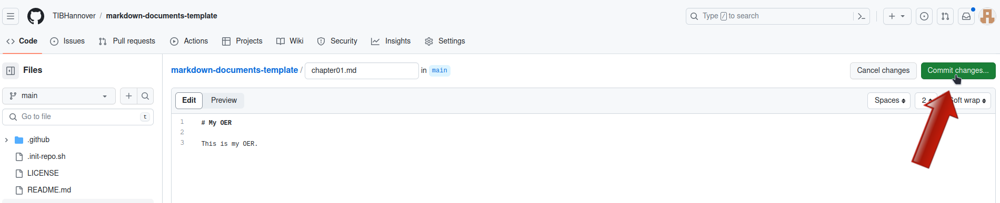
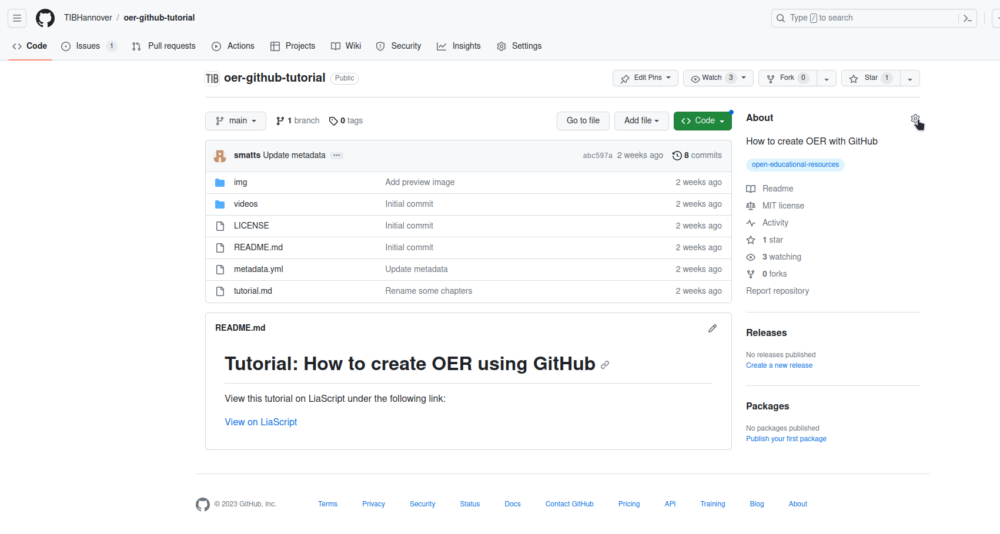

## Step by step tutorial
In this step by step tutorial we'll cover the following steps:

* [Requirements](#requirements)
* [Create a project](#create-a-project)
* [Fill with your own content](#fill-with-content)
* [Generate output](#generate-output)
* [Add your metadata](#add-your-metadata)
* [Configuration options](#configuration-options)
* [Insert into OERSI](#insert-your-oer-in-oersi)

> After completing all of these steps, you will have your OER hosted on GitHub and listed in OERSI.

### Requirements

> For this tutorial, **you will need a GitHub account**. It is also recommended to **get to know Markdown**, a markup language which can create formatted text using only plain-text, since Markdown is used to write and format your content.
>
> If you already have a GitHub account and know basic markdown syntax, you can skip this part and directly go do [Create a project](#create-a-project).

### Create a GitHub account

If you don't have an account yet, go to [GitHub](https://github.com/) and sign up. Confirm your e-mail address and log in.

### Markdown

From Matt Cone's [Markdown guide](https://www.markdownguide.org/getting-started/):

>Markdown is a lightweight markup language that you can use to add formatting elements to plaintext text documents. Created by John Gruber in 2004, Markdown is now one of the world’s most popular markup languages.
>
>Using Markdown is different than using a WYSIWYG editor. In an application like Microsoft Word, you click buttons to format words and phrases, and the changes are visible immediately. Markdown isn’t like that. When you create a Markdown-formatted file, you add Markdown syntax to the text to indicate which words and phrases should look different.
>
>For example, to denote a heading, you add a number sign before it (e.g., # Heading One). Or to make a phrase bold, you add two asterisks before and after it (e.g., **this text is bold**). It may take a while to get used to seeing Markdown syntax in your text, especially if you’re accustomed to WYSIWYG applications.

If you want to learn about Markdown, what it is and what you can do with it, you can read this guide: [Get Started](https://www.markdownguide.org/getting-started/).

To see basic formatting options, check out the [Cheat Sheet](https://www.markdownguide.org/cheat-sheet/). More basic syntax can be found in the [Basic Syntax](https://www.markdownguide.org/basic-syntax/) guide.

Some of the basic Markdown syntax is shown in the reference part of this tutorial: [Reference: Markdown](#markdown-1).

### Create a project

> The place where you will put your OER is called a `repository`. You can think of it as a project where all your files are located.

Once you are logged into GitHub, go to the [Jupyter OER Template](https://github.com/smatts/jupyter-oer-template/tree/main) and click on "Use this template" -> "Create a new repository".


Assign the repository to the correct owner and give it a short but meaningful name. The name will be the URL of the repository as well. You can add a description if you want. Now make sure that the visibility of the repository is set to **public**. This has two main reasons: firstly, so people can see your OER, and secondly to use the GitHub pages functionality which we will get to later. Lastly, confim by clicking on "Create repository from template".

Now, a new repository is initialized for you containing the contents from the template.

### Fill with content

> Currently, there is still dummy data inside your repository. The next step is to replace this dummy data with your actual OER.

### How and where to upload your own content

In the repository, you can find two Markdown files that contain the book's contents. These are our dummy content files.

* `00_intro.md`
* `01_chapter.md`

You can either edit or delete them. You can of course create new files, too.
If you create new files, make sure that they end with the correct file format ending `.md`, so `filename.md`.

To edit a file, click on the file name in the index of your repository.


Then, in the top right corner of the file, click on the pen button to edit the file.


Now, you can replace the content with your own. Add as much as you like.
The file is a `Markdown` file, so you should write your content using this markup language.
You can find more about Markdown in the [Markdown section](#markdown-1) in the reference part of this tutorial.

Once you are done, you can save your changes by clicking on the green `Commit changes...` button in the top right corner.



Add a meaningful but short commit message, which is a message describing the changes you have made, and optionally a longer description.
Then confirm by clicking the green `Commit changes` button.


### What not to do
Using emojis or other unicode characters can break the build.

### Listing your content files

In order to get your content into your JupyterBook, it has to be listed in a file called `_toc.yml`.
This file is your table of contents.
List your content files in the order you want them to appear in.
For example, this is the `_toc.yml` file from our template:

```yaml
# In _toc.yml
# Table of contents
# Learn more at https://jupyterbook.org/customize/toc.html

format: jb-book
root: 00_intro
chapters:
 - file: 01_chapter
```

We have two content files in this repository: `00_intro.md` and `01_chapter.md`.
The `root` is the content that you see at the index of the book, so it is the first content of the book, the *root*.
Then, you list the chapters in the order you want them to be in.
If you want to add a new file called `02_chapter.md` to this list, you would add it under the ` - file: 01_chapter` entry.
It is important that you use the same syntax here, so a space, a hyphen, a space and then `file:` with another space.
In the end, it would look like this:

```yaml
# In _toc.yml
# Table of contents
# Learn more at https://jupyterbook.org/customize/toc.html

format: jb-book
root: 00_intro
chapters:
 - file: 01_chapter
 - file: 02_chapter
```

Note that the files themselves end with the `.md` markdown file ending, but in the `_toc.yml` table of contents file, we do not include this ending.

There are plenty more options to configure your table of contents.
You can find them in the JupyterBook documentation: [Structure the table of contents](https://jupyterbook.org/en/stable/structure/toc.html)

### Why can I not see the updated content?
If you have committed all your changes and still can not see them on your generated landing page and documents, try deleting the cache and reload the page (or open your page in a new private tab). A shortcut to reload and refresh at the same time is `Ctrl + F5`.

Please note that changes can take a few minutes to be built into the generated documents.

If it still does not work, check your document for forbidden characters (such as emojis or other unicode characters) and ensure that the names of your Markdown files do not contain spaces or other unsuitable characters for filenames, as both can break the document generation scripts.

### Generate output

> The automatic generation will take your content and generate your book. This generation is done each time you change something in your repository, so your content will always be up to date.

In order to generate the different output formats for your OER, go to the project's `Settings` -> `Pages` and in `Build and Development` set the source to `GitHub Actions`. After this, you can head to the `Actions` tab and click on the newest workflow run. If the worklow already ran, you will find that it failed. This happened because the Pages were not enabled yet. In this case, click on re-run jobs. Otherwise, wait until the jobs have finished. The pages and documents are now created.

Congratulations, you now have a complete course/document that you can make your own!

#### What are Actions?

> An `Action` is something that GitHub can execute with every commit (save) you make to the repository. This includes the generation of documents or pages, which we are using in this tutorial.
>
> A more detailed explanation of GitHub Actions can be found here: [Understanding GitHub Actions](https://docs.github.com/en/actions/learn-github-actions/understanding-github-actions).

#### What are Pages?
> A `Page` is a public website hosted by GitHub. We can use GitHub Actions to automatically generate our website and then host it on GitHub Pages for everyone to see. You can either host your site for free on `your-username.github.io` or use your own costum domain if you have one.
>
>More information on GitHub Pages can be found here: [About GitHub Pages](https://docs.github.com/en/pages/getting-started-with-github-pages/about-github-pages).

### Add your metadata

> Metadata is the data describing your OER. This includes information like the title, author, license and much more. If you don't supply metadata with your repository, it is unclear what your OER is about, who it is from, if and how your OER can be used and so on. This is why we have a `metadata.yml` file in our repository. This file lets us include the information about the OER directly in the repository. This is also necessary for inserting your OER into a search index like [OERSI](https://oersi.org). This section shows how to replace the dummy metadata in the repository with the correct metadata describing your OER.

Perhaps the easiest way to generate your own metadata for your repository in the correct format is to use the [OERSI metadata generator](https://oersi.gitlab.io/metadata-form/metadata-generator.html) and fill out at least all required fields, but try to fill out as much as you can.


Now at the bottom of the page, you can click on `Generate`. This generates the metadata in the correct format. You can then copy the output to your clipboard either by using the `Copy` button, or by selecting the whole text (`Ctrl + A`) and copying it (`Ctrl + C`).


In your GitHub repository, edit the `metadata.yml` file. Now delete the whole file content and paste the output of the generator.
To save, click on `Commit changes...` in the top right corner. Confirm by clicking on `Commit changes`.

#### Video: Update the metadata
<video width="100%" src="_static/videos/metadata-placeholder.mp4" controls></video>

### Insert your OER in OERSI
> Let's assume that...
>
> * you have put your whole completed course or document content into the repository, and it's either ordered alphabetically or you have defined the correct order in the `config.yml` file,
> * you have enabled the `Pages` for `GitHub Actions` and there are no errors during Action execution, thus you have a published Page that represents the current version of your repository,
> * you have entered full and correct metadata, ensuring the license is correct and you are not violating another work's license with this license,
> * inside your `metadata.yml` file, you have set your creative work status to `Published` and the educational level to `University`,
>
> **then you are ready to put your OER into OERSI!**

To put your course into the Open Ecucational Resources Search Index (OERSI), head to the `About` settings in the index of your repository. Then in `Topics`, add `open-educational-resources`.




The [OERSI](https://oersi.org) updates its index every night. So you will be able to find your OER the next day either through the search bar or by filtering using the filters on the left (e.g. search for your name in `Author` or setting the `Provider` to GitHub to only show OER from GitHub).

If you want to immediately see your changes in the OERSI, you can use the [record updater](https://oersi.org/resources/pages/de/record_update/).

To take the OER out of OERSI, simply set the status (`creativeWorkStatus`) in the `metadata.yml` to `Draft` or `Incomplete` (or alternatively, you could remove the topic `open-educational-resources`).

### Done!
Congratulations, you did it!

If you want to learn more about what you can do with this template, you can continue with the [reference](#reference) part.